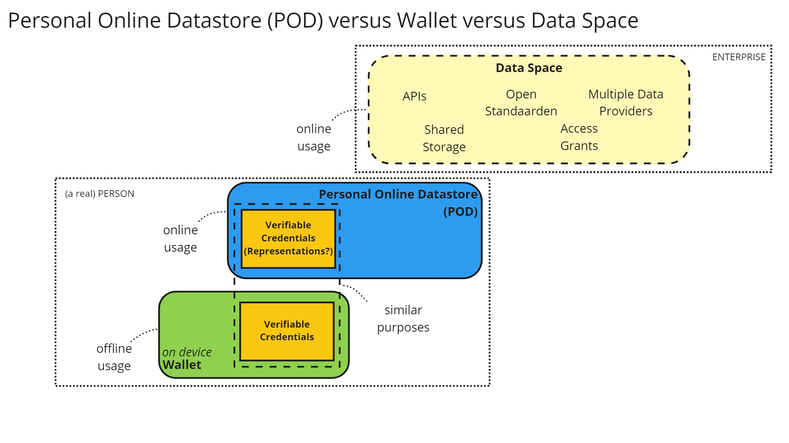
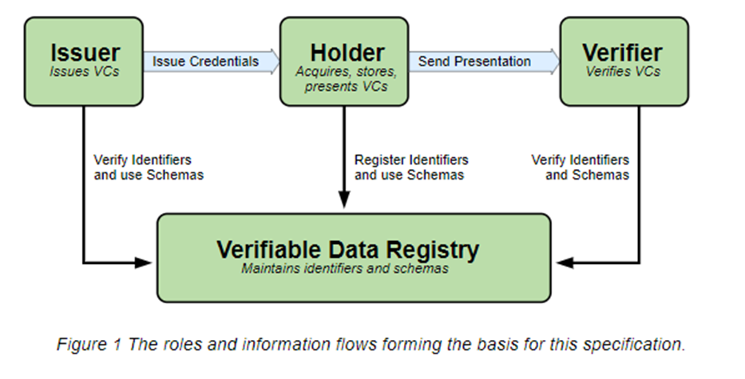
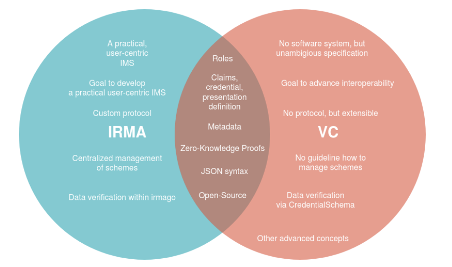

# SOLID Quest - Achtergrondinformatie

Dit bestand is een verzameling van de kennis en terminologie die we hebben vergaard tijdens onze quest:
- [Data PODs vs data spaces](#data-pods-vs-data-spaces)
- [WebID](#webid)
- [Verifiable Credentials](#verifiable-credentials-vcs)
  - [Verifiable Data Registry](#verifiable-data-registry)
  - [VCs vs IRMA](#vcs-vs-irma)
- [Europese Digitale Identiteit](#europese-digitale-identiteit-edi) 
  - [Wat houdt EDI in?](#wat-houdt-edi-in)
  - [Welke stappen gaan er in 2023 genomen worden?](#welke-stappen-gaan-er-in-2023-genomen-worden)
  - [Wat betekent dit voor het Kadaster?](#wat-betekent-dit-voor-het-kadaster)

## Data PODs vs data spaces

We merken dat de termen data PODs en data spaces vaak door elkaar worden gebruikt, terwijl er volgens ons verschillende dingen mee worden bedoeld. Voor data PODs is de definitie van [PLDN](https://www.pldn.nl/wiki/PODS) vrij duidelijk:

> "Personal Online Data Stores (PODS) of Personal Online Data Storage Containers zijn beveiligde online opslagplaatsen voor persoonlijke gegevens waar apps toegang tot kunnen hebben als zij daarvoor geautoriseerd zijn."

De definitie van een data space is minder duidelijk. [Gaia-X](https://gaia-x.eu/what-is-gaia-x/core-elements/data-spaces/) heeft het bijvoorbeeld over 

> "The term ‘data space’ refers to a type of data relationship between trusted partners who adhere to the same high level standards and guidelines in relation to data storage and sharing within one or many Vertical Ecosystems." 

Onze vertaling is dat PODs vooral gericht zijn op persoonlijke data kluizen; een persoonlijke online datastore. Als burger heb ik zelf controle over wat ik daar in zet, wie of welke apps ik toegang verleen en welke data ik (dus) deel met wie. De visie van het Solid Project gaat nog verder in de zin dat _alle_ data die ik online deel, in mijn POD zou moeten staan. Applicaties en platformen kunnen deze data gebruiken zolang zij toegang verleent krijgen door de burger zelf. Platformen als Facebook, Twitter e.d. zijn rijke applicaties die vooral bestaan om de functionaliteiten die zij bieden, terwijl de data in alle PODs van alle gebruikers staat. (Dit is ook wat [Post Platforms Initiative](https://postplatforms.org/#concept) tracht te bereiken)

Data spaces lijken meer gericht te zijn op organisaties met als doel het stimuleren en bereiken van data delen/samenwerken en tegelijkertijd controle te houden over je data.

Binnen dit project zal de focus meer liggen op data PODs.

## WebID

Een WebID duidt op meerdere 'dingen'. Het is:

1. een unieke IRI (International Resource Identifier) en URL
1. een document dat een 'resource' beschrijft; dat kan een beschrijving van de mens zijn, zijn profiel dus, maar ook een organisatie, een service (bot)
1. een service voor authenticatie en deels autorisatie (OpenID Connect / OAuth2)

## Verifiable Credentials (VCs)

Verifiable Credentials (VCs) zijn een open standaard voor digitale attributen/referenties. Op de pagina van [W3C](https://www.w3.org/TR/vc-data-model/) kan je veel informatie vinden over VCs. Hun definitie van een VC is als volgt: "A verifiable credential is a tamper-evident credential that has authorship that can be cryptographically verified." Waarbij een credential een "set of one or more claims made by an issuer" is. Vanuit een VC kan een Verifiable Presentation worden gemaakt. 

Schematische weergave

### Verifiable Data Registry

Om de integriteit van VCs te waarborgen wil je er zeker van zijn dat een bepaalde VC is uitgegeven, door een issuer die daartoe bevoegd is, én niet is ingetrokken. Hier kan een Verifiable Data Registry, zoals bovenstaand afgebeeld, een cruciale rol spelen. In dit register wordt de metadata van uitgegeven VCs (het bewijs) weggeschreven. Dit zegt dus alleen iets over de herkomst van een VC en niets over de inhoudelijke juistheid van een VC. Het register kan zowel decentraal als centraal worden beheerd. Dataminimalisatie kan (en moet) in beide gevallen toegepast worden. Voor meer informatie, zie: [Issue: Verifiable Data Registry](https://github.com/kadaster-labs/solid-quest/issues/54))

### VCs vs IRMA

[IRMA](https://irma.app/) is een product (app) waarbinnen je attributen kunt laden en daar zelf controle over hebt. IRMA werkt met "disclosure proof" die lijken op VCs (zie hoofdstuk [Cryptographic Entities](https://irma.app/docs/overview/#cryptographic-entities). De 'disclosure proofs' maken IRMA inderdaad verifieerbaar, maar is niet helemaal hetzelfde als een VC. Waar het hier bij beiden over gaat is de data integriteit, het kunnen verifiëren dat je niet zelf aan de attributen loopt te sleutelen. Binnen VC signeert de issuer de credential die die uitgeeft. Iedereen kan die vervolgens verifiëren op basis van de meegeleverde proof, meestal een verwijzing naar de public key van de issuer. Binnen IRMA is het de IRMA server zelf die een signature toevoegd, de disclosure proof. Dat maakt het ook dat non-IRMA applicaties niet de IRMA attributen kan verifieren, maar alleen IRMA servers dat zelf kunnen, in tegenstelling tot VC. 

Het doel van VC is om een open standaard te creeëren om credentials uit te kunnen wisselen. Op dit moment is IRMA niet compatible met VC en werkt dus alleen binnen het IRMA ecosysteem zelf. Er lijken meer demo's te zijn i.c.m. met IRMA, omdat die al verder lijkt te zijn. VC is echt nog meer in ontwikkeling.

## Europese Digitale Identiteit (EDI)
### Wat houdt EDI in?
EDI staat voor Europese Digitale Identiteit. De Europese Commissie kwam op 3 juni 2021 met een [wetsvoorstel voor het EDI raamwerk](https://eur-lex.europa.eu/legal-content/EN/TXT/HTML/?uri=CELEX:52021PC0281&from=EN) om de eIDAS verordening te herzien. Het is een raamwerk voor Europese Digitale Identiteiten; een set van afspraken waardoor nationaal uitgegeven Digitale Identiteiten en de wallets waarin deze worden meegedragen wederzijds worden erkend in de verschillende Europese lidstaten.

Een wallet en digitale identiteit is niet hetzelfde. Een wallet is een applicatie of toepassing op een telefoon of tablet waarin een digitale identiteit (set van gegevens) kan worden opgeslagen en meegenomen. Het uitgangspunt is dat het gebruik van de wallet vrijwillig is voor burgers. 

### Welke stappen gaan er in 2023 genomen worden?
Europa gaat onderhandelen over de herziening van de eIDAS-verordening. Het betrouwbaar inloggen met elektronische identiteiten bij (semi-)overheidsdiensten, eventueel over de grens, is al geregeld.  Met de beoogde herziening ‘Raamwerk Europese Digitale Identiteit’ (EDI) moeten de volgende zaken ook geregeld worden:
-	Alle lidstaten geven verplicht één of meer wallets uit. Wallets kunnen niet alleen in het publieke domein gebruikt worden, maar ook in het private domein (bijv. Google, Facebook & Amazon).
-	Burgers en bedrijven kunnen hun digitale (bron)identiteit en gegevens, zoals diploma’s, zelf delen via een wallet applicatie op hun smartphone.
-	Het gebruik van wallets voor natuurlijke personen is gratis, de wallet voldoet aan toegankelijkheidseisen en aan het hoogste niveau van betrouwbaarheid bij uitgifte en gebruik.
-	Wallets zijn geschikt voor offline gebruik zonder internet.
-	Wallets moeten de vertrouwensdiensten elektronische handtekening en zegel bevatten. Daarnaast is er verplichte nationale certificering, in Nederland door het Agentschap Telecom.

Overeenstemming over en publicatie van de eIDAS-verordening wordt eind 2023 verwacht.

In Nederland bestaat het [programma EDI Stelsel NL](https://edi.pleio.nl/). Dit programma zal een werkende eerste versie van een Nederlandse [open source wallet](https://github.com/MinBZK/nl-wallet-demo-app) neerzetten in 2023. Bij het ontwikkelen van die wallet staat co-creatie voorop, waarbij het bedrijfsleven, de wetenschap en ieder ander die zich betrokken voelt uitgenodigd wordt om concrete bijdragen te leveren.
	
### Wat betekent dit voor het Kadaster?
De Nederlandse overheid heeft de [Werkagenda Waardengedreven Digitaliseren](https://www.digitaleoverheid.nl/kabinetsbeleid-digitalisering/werkagenda/) opgesteld. Eén van de programmalijnen luidt: "Iedereen heeft regie op het digitale leven." Daarvoor is regelgeving en beleid nodig, rond wallets en basisvoorzieningen.  

In de [Digital Identity Architectural Reference Framework (ARF)](https://futurium.ec.europa.eu/sites/default/files/2022-02/Outline%20final.pdf), de onderlegger van het Europese EDI-stelsel, krijgen uitvoeringsorganisaties naast de rol van verstrekker van persoonsgegevens de taak om de betrouwbaarheid van data te verifiëren, die uit de wallet komen (zie: [iBestuur](https://ibestuur.nl/partner-live-event/herziene-eidas-grote-impact-op-uitvoeringsorganisaties). Dit betekent dat de systemen en processen zo ingericht moeten worden dat ze aan de eisen kunnen voldoen.

Bovenstaande geldt dus ook voor het Kadaster. Het begrijpen van de technologie is randvoorwaardelijk (!) om je voor te bereiden op deze ontwikkelingen. Daarom onderzoeken we binnen de demonstrator ook de rol van [Verifiable Credentials](#verifiable-credentials-vcs):
-	Hoe kan Kadaster in de rol van Issuer gegevens verstrekken? (Zie: [Issue: VC issuer Kadaster eigendomsrecht van perceel](https://github.com/kadaster-labs/solid-quest/issues/34))
-	Hoe kan Kadaster in de rol van Verifier gegevens valideren? (Zie: [Issue: VC verifier Kadaster van ingeschreven koopovereenkomst](https://github.com/kadaster-labs/solid-quest/issues/36))

