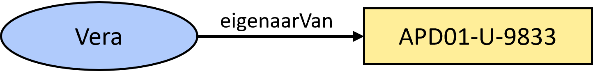
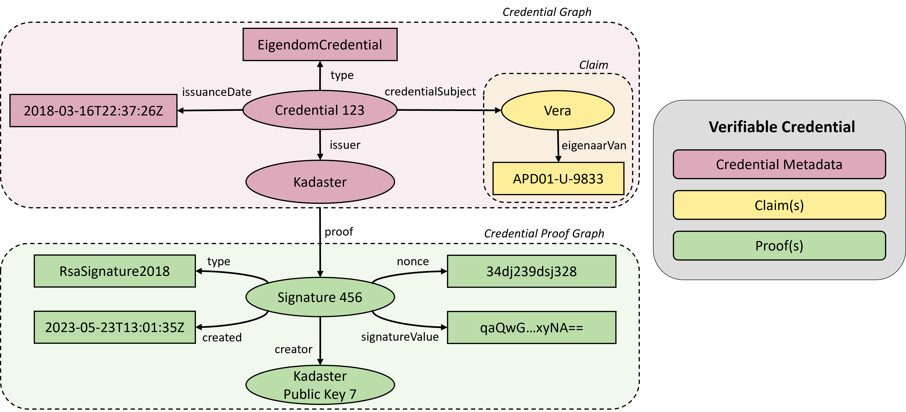

<!-- omit from toc -->
# SOLID Quest - Achtergrondinformatie

Dit bestand is een verzameling van de kennis en terminologie die we hebben vergaard tijdens onze quest:
- [Data PODs vs data spaces](#data-pods-vs-data-spaces)
- [WebID](#webid)
- [Verifiable Credentials](#verifiable-credentials)
  - [Structuur van een Verifiable Credential](#structuur-van-een-verifiable-credential)
  - [Verifiable Data Registry](#verifiable-data-registry)
  - [Data Minimalisatie](#data-minimalisatie)
  - [Verifiable Presentation](#verifiable-presentation)
  - [Alternatieven voor Verifiable Credentials](#alternatieven-voor-verifiable-credentials)
- [Europese Digitale Identiteit (EDI)](#europese-digitale-identiteit-edi)
  - [Wat houdt EDI in?](#wat-houdt-edi-in)
  - [Welke stappen gaan er in 2023 genomen worden?](#welke-stappen-gaan-er-in-2023-genomen-worden)
  - [Wat betekent dit voor het Kadaster?](#wat-betekent-dit-voor-het-kadaster)

## Data PODs vs data spaces

We merken dat de termen data PODs en data spaces vaak door elkaar worden gebruikt, terwijl er volgens ons verschillende dingen mee worden bedoeld. Voor data PODs is de definitie van [PLDN](https://www.pldn.nl/wiki/PODS) vrij duidelijk:

> "Personal Online Data Stores (PODS) of Personal Online Data Storage Containers zijn beveiligde online opslagplaatsen voor persoonlijke gegevens waar apps toegang tot kunnen hebben als zij daarvoor geautoriseerd zijn."

De definitie van een data space is minder duidelijk. [Gaia-X](https://gaia-x.eu/what-is-gaia-x/core-elements/data-spaces/) heeft het bijvoorbeeld over 

> "The term ‘data space’ refers to a type of data relationship between trusted partners who adhere to the same high level standards and guidelines in relation to data storage and sharing within one or many Vertical Ecosystems." 

Onze vertaling is dat PODs vooral gericht zijn op persoonlijke data kluizen; een persoonlijke online datastore. Als burger heb ik zelf controle over wat ik daar in zet, wie of welke apps ik toegang verleen en welke data ik (dus) deel met wie. De visie van het Solid Project gaat nog verder in de zin dat _alle_ data die ik online deel, in mijn POD zou moeten staan. Applicaties en platformen kunnen deze data gebruiken zolang zij toegang verleent krijgen door de burger zelf. Platformen als Facebook, Twitter e.d. zijn rijke applicaties die vooral bestaan om de functionaliteiten die zij bieden, terwijl de data in alle PODs van alle gebruikers staat. (Dit is ook wat [Post Platforms Initiative](https://postplatforms.org/#concept) tracht te bereiken)

Data spaces lijken meer gericht te zijn op organisaties met als doel het stimuleren en bereiken van data delen/samenwerken en tegelijkertijd controle te houden over je data.

Binnen dit project zal de focus meer liggen op data PODs.

## WebID

Een WebID duidt op meerdere 'dingen'. Het is:

1. een unieke IRI (International Resource Identifier) en URL
1. een document dat een 'resource' beschrijft; dat kan een beschrijving van de mens zijn, zijn profiel dus, maar ook een organisatie, een service (bot)
1. een service voor authenticatie en deels autorisatie (OpenID Connect / OAuth2)

## Verifiable Credentials

Verifiable Credentials (VCs) zijn een open standaard voor digitale attributen/referenties. Op de pagina van [W3C](https://www.w3.org/TR/vc-data-model/) kan je veel informatie vinden over VCs. Hun definitie van een VC is als volgt: "A verifiable credential is a tamper-evident credential that has authorship that can be cryptographically verified." Waarbij een credential een "set of one or more claims made by an issuer" is.

> ⚠ De VC standaard is een standaard die nog *working draft* status heeft, dat wil zeggen dat die nog niet klaar is voor productiesystemen. Wel is die volop in ontwikkeling en wordt er voortgang mee gemaakt. Daarbij krijgen VCs ook steeds meer aandacht van verschillende partijen. Betrouwbaar, open en verifieerbaar data uitwisselen wordt steeds belangrijker, en deze standaard lijkt het meest veelbelovend om hier een (grote) rol in te gaat spelen. Daarom is er voor gekozen om VCs verder te onderzoeken.

### Structuur van een Verifiable Credential

  
  
<em>Een eenvoudige claim die aangeeft dat Vera eigenaar is van het perceel met identificatie "APD01-U-9833".</em>

VCs bevatten verschillende componenten. Een VC bestaat uit een set van één of meer claims, die beweringen bevatten over specifieke kenmerken of attributen van de entiteit. Deze claims kunnen betrekking hebben op zaken zoals persoonlijke identiteit, eigendomsrechten, professionele kwalificaties en meer.

Een belangrijk onderdeel van een VC is de issuer, de entiteit die de VC uitgeeft. De issuer voegt zijn digitale handtekening toe aan de VC, waardoor de authenticiteit en integriteit van de VC kunnen worden geverifieerd.

  
  
<em>Voorbeeld van een informatiegraaf van een eenvoudige VC</em>

Een voorbeeld van een eenvoudige VC is een claim die aangeeft dat Vera eigenaar is van het perceel met identificatie "APD01-U-9833". Deze claim wordt ondersteund door een digitale handtekening van de issuer, wat de verifieerbaarheid van de claim mogelijk maakt.

Op deze manier stellen VCs entiteiten in staat om betrouwbare digitale referenties te verkrijgen en te delen, waardoor het vertrouwen en de veiligheid in digitale transacties en identiteitsverificatie worden vergroot.

### Verifiable Data Registry

De Verifiable Data Registry (VDR) is een conceptueel element binnen een VC-ecosysteem en fungeert als scheidsrechter of mediator tussen de verschillende partijen. Het speelt een essentiële rol bij het creëren en verifiëren van VCs en andere relevante gegevens, waardoor er vertrouwen ontstaat binnen het ecosysteem. Een VDR kan informatie bevatten over VC-schema's, geregistreerde issuers en intrekkingslijsten. Het kan ook transacties en uitgegeven VCs bijhouden, waarbij de persoonlijke gegevens zelf niet worden opgeslagen.

  
  
<em>Schematische weergave. Bron <a href="https://www.w3.org/TR/vc-data-model/#ref-for-dfn-verifiable-data-registries-1">Verifiable Credentials Data Model v1.1</a></em>

Verschillende VC-ecosystemen zullen verschillende VDR's hebben, waarbij de onderliggende technologie kan variëren. Mogelijke implementaties van een VDR omvatten vertrouwde databases, gedecentraliseerde databases, overheids-ID-databases en gedistribueerde ledgers. Het is ook mogelijk dat binnen één ecosysteem meerdere VDR's worden gebruikt om verschillende aspecten van de VC-uitwisseling te ondersteunen. De keuze voor een specifieke VDR hangt af van de context en de vereisten van het systeem. Het belangrijkste is dat de VDR zorgt voor een betrouwbaar en veilig beheer van VC-gerelateerde informatie en bijdraagt aan het vertrouwen tussen de betrokken partijen.

Een Verifiable Data Registry wordt vaak gebruikt bij de intrekking (revocation) van VCs. Intrekking verwijst naar het vroegtijdig beëindigen van de geldigheid van een verifieerbare referentie. Door het gebruik van een Verifiable Data Registry kan informatie over ingetrokken VCs worden bijgehouden. Bij het verifiëren van een VC kan de verifiërende partij het register raadplegen om te controleren of de VC nog steeds geldig is.

### Data Minimalisatie

Data minimalisatie is een essentieel principe binnen VCs dat tot doel heeft de hoeveelheid persoonlijke gegevens te minimaliseren die worden verzameld, verwerkt en opgeslagen. Het minimaliseren van gegevens heeft als doel de privacy van gebruikers te beschermen en het risico op ongeoorloofde toegang tot gevoelige informatie te verminderen. Binnen VCs worden alleen de noodzakelijke gegevens opgenomen om een specifieke claim te ondersteunen, waardoor overbodige persoonlijke gegevens worden weggelaten. Dit draagt bij aan het beperken van potentiële gegevensinbreuken en het minimaliseren van de blootstelling van persoonlijke informatie, waardoor de privacy van individuen beter wordt beschermd.

Verschillende vormen van disclosure-methoden, manieren om informatie te delen, zijn binnen VCs mogelijk. De drie vormen van disclosure zijn:

1. **Volle Disclosure**: Dit is de meest simpele vorm waarbij de volledige VC wordt gedeeld met de verifier, dus een alles-of-niets actie. Veel digitale identiteitssystemen onthullen nu alle attributen in een digitale credential, wat risico's met zich meebrengt. Hierbij wordt niets van de data geminimaliseerd.

2. **Selectieve Disclosure**: Selectieve disclosure houdt in dat de holder alleen specifieke delen van de informatie onthult aan de verifiërende partij, terwijl andere delen verborgen blijven. Hierdoor kan de holder selectief informatie onthullen op basis van de vereisten van de verifiërende partij.

3. **Predicate Proof**: Een predicate proof houdt in dat de holder bewijst dat een bepaalde claim voldoet aan een bepaalde voorwaarde, zonder de specifieke details van de claim bekend te maken. Hierdoor kan een verifieerbare referentie met een geboortedatumclaim bijvoorbeeld worden gebruikt om te bewijzen dat iemand ouder is dan 18 jaar, zonder de geboortedatum prijs te geven. 

Elke vorm van disclosure biedt verschillende gradaties van openbaarmaking van informatie, afhankelijk van de vereisten en behoeften van de partijen die betrokken zijn bij het verificatieproces.

### Verifiable Presentation
Waar een VCs altijd een bewijs is wat door een issuer wordt uitgegeven, is een Verifiable Presentation (VP) iets wat de holder op diens beurt met een verifier kan delen. De data die met een VP kan worden gedeeld kan simpelweg één of de combinatie van meerdere VCs zijn. Ook is het mogelijk om middels [data minimalisatie](#data-minimalisatie) een deel of een afgeleide van een VC te delen. Dit geeft de holder meer controle over hoe die gegevens uit een VC met verifiers wil delen.

### Alternatieven voor Verifiable Credentials

Naast VCs zijn er ook andere oplossingen beschikbaar die vergelijkbare functionaliteit bieden. Een van deze alternatieven is [Yivi](https://www.yivi.app) (voorheen bekend als IRMA), een product (app) waarmee attributen kunnen worden geladen en waarover gebruikers zelf controle hebben. Yivi maakt gebruik van "disclosure proofs" die enige overeenkomsten vertonen met VCs (zie hoofdstuk [Cryptographic Entities](https://irma.app/docs/overview/#cryptographic-entities)). Deze "disclosure proofs" maken het mogelijk om claims te verifiëren, maar verschillen op bepaalde punten van VCs.

  
  
<em>Bron: <a href="https://research.ou.nl/ws/portalfiles/portal/31027221/Ostkamp_D_IM9906_AF_SE_scriptie_Pure.pdf">IRMA and Verifiable Credentials What is their relation?</a></em>

Een belangrijk aspect waar zowel VCs als Yivi zich op richten, is de integriteit van gegevens en de mogelijkheid om te verifiëren dat attributen niet onrechtmatig worden gewijzigd. Bij VCs wordt de credential ondertekend door de uitgevende partij (issuer) en kan deze door iedereen worden geverifieerd op basis van de bijgeleverde proof, meestal een verwijzing naar de public key van de issuer. Bij Yivi voegt de Yivi-server zelf een handtekening toe aan de attributen, die bekendstaan als "disclosure proofs". Hierdoor kunnen non-Yivi-applicaties de attributen niet verifiëren, maar alleen de Yivi-servers zelf.

Het doel van de Verifiable Credentials werkgroep is om een open standaard te creëren voor het uitwisselen van credentials. Op dit moment is Yivi niet compatibel met VC en werkt het alleen binnen het Yivi-ecosysteem zelf. Er lijken echter meer demo's beschikbaar te zijn die gebruikmaken van Yivi, omdat het al verder ontwikkeld lijkt te zijn. VC bevindt zich nog steeds in een meer ontwikkelingsfase.

## Europese Digitale Identiteit (EDI)
### Wat houdt EDI in?
EDI staat voor Europese Digitale Identiteit. De Europese Commissie kwam op 3 juni 2021 met een [wetsvoorstel voor het EDI raamwerk](https://eur-lex.europa.eu/legal-content/EN/TXT/HTML/?uri=CELEX:52021PC0281&from=EN) om de eIDAS verordening te herzien. Het is een raamwerk voor Europese Digitale Identiteiten; een set van afspraken waardoor nationaal uitgegeven Digitale Identiteiten en de wallets waarin deze worden meegedragen wederzijds worden erkend in de verschillende Europese lidstaten.

Een wallet en digitale identiteit is niet hetzelfde. Een wallet is een applicatie of toepassing op een telefoon of tablet waarin een digitale identiteit (set van gegevens) kan worden opgeslagen en meegenomen. Het uitgangspunt is dat het gebruik van de wallet vrijwillig is voor burgers. 

### Welke stappen gaan er in 2023 genomen worden?
Europa gaat onderhandelen over de herziening van de eIDAS-verordening. Het betrouwbaar inloggen met elektronische identiteiten bij (semi-)overheidsdiensten, eventueel over de grens, is al geregeld.  Met de beoogde herziening ‘Raamwerk Europese Digitale Identiteit’ (EDI) moeten de volgende zaken ook geregeld worden:
-	Alle lidstaten geven verplicht één of meer wallets uit. Wallets kunnen niet alleen in het publieke domein gebruikt worden, maar ook in het private domein (bijv. Google, Facebook & Amazon).
-	Burgers en bedrijven kunnen hun digitale (bron)identiteit en gegevens, zoals diploma’s, zelf delen via een wallet applicatie op hun smartphone.
-	Het gebruik van wallets voor natuurlijke personen is gratis, de wallet voldoet aan toegankelijkheidseisen en aan het hoogste niveau van betrouwbaarheid bij uitgifte en gebruik.
-	Wallets zijn geschikt voor offline gebruik zonder internet.
-	Wallets moeten de vertrouwensdiensten elektronische handtekening en zegel bevatten. Daarnaast is er verplichte nationale certificering, in Nederland door het Agentschap Telecom.

Overeenstemming over en publicatie van de eIDAS-verordening wordt eind 2023 verwacht.

In Nederland bestaat het [programma EDI Stelsel NL](https://edi.pleio.nl/). Dit programma zal een werkende eerste versie van een Nederlandse [open source wallet](https://github.com/MinBZK/nl-wallet-demo-app) neerzetten in 2023. Bij het ontwikkelen van die wallet staat co-creatie voorop, waarbij het bedrijfsleven, de wetenschap en ieder ander die zich betrokken voelt uitgenodigd wordt om concrete bijdragen te leveren.
 
### Wat betekent dit voor het Kadaster?
De Nederlandse overheid heeft de [Werkagenda Waardengedreven Digitaliseren](https://www.digitaleoverheid.nl/kabinetsbeleid-digitalisering/werkagenda/) opgesteld. Eén van de programmalijnen luidt: "Iedereen heeft regie op het digitale leven." Daarvoor is regelgeving en beleid nodig, rond wallets en basisvoorzieningen.  

In de [Digital Identity Architectural Reference Framework (ARF)](https://futurium.ec.europa.eu/sites/default/files/2022-02/Outline%20final.pdf), de onderlegger van het Europese EDI-stelsel, krijgen uitvoeringsorganisaties naast de rol van verstrekker van persoonsgegevens de taak om de betrouwbaarheid van data te verifiëren, die uit de wallet komen (zie: [iBestuur](https://ibestuur.nl/partner-live-event/herziene-eidas-grote-impact-op-uitvoeringsorganisaties). Dit betekent dat de systemen en processen zo ingericht moeten worden dat ze aan de eisen kunnen voldoen.

Bovenstaande geldt dus ook voor het Kadaster. Het begrijpen van de technologie is randvoorwaardelijk (!) om je voor te bereiden op deze ontwikkelingen. Daarom onderzoeken we binnen de demonstrator ook de rol van [Verifiable Credentials](#verifiable-credentials-vcs):
-	Hoe kan Kadaster in de rol van Issuer gegevens verstrekken? (Zie: [Issue: VC issuer Kadaster eigendomsrecht van perceel](https://github.com/kadaster-labs/solid-quest/issues/34))
-	Hoe kan Kadaster in de rol van Verifier gegevens valideren? (Zie: [Issue: VC verifier Kadaster van ingeschreven koopovereenkomst](https://github.com/kadaster-labs/solid-quest/issues/36))

