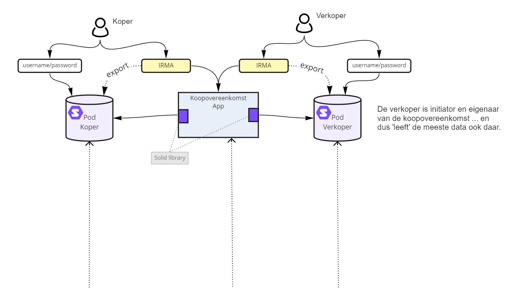

# SOLID Quest

Our journey on [SOLID pods](https://solidproject.org/) ... towards the goal of creating a [Demonstrator Koopovereenkomst Solid App](#demonstrator-koopovereenkomst-solid-app).

[Demo](https://marcvanandel.github.io/solid-quest/)

## Collected Info

- SOLID core / general info
  - [SOLID Project](https://solidproject.org/) - the _base_ of SOLID
  - [SolidOS](https://github.com/SolidOS/solidos)
  - [SolidLabResearch | Bashlib](https://github.com/SolidLabResearch/Bashlib) - a suite of functionality to facilitate use and development for Solid, mainly focused on supporting the [Community Solid Server](https://github.com/CommunitySolidServer/CommunitySolidServer)
- [Universidad de Oviedo](https://arquisoft.github.io/) is actively developing and teaching about Software Architectures using SOLID
  - [Decentralized Chat App built on SOLID](https://arquisoft.github.io/dechat_es6a2/documentation.html) - Winning team of the 2019 challenge
  - [2021/2022 assignment: Decentralized Delivery (DeDe)](https://arquisoft.github.io/course2122/labAssignmentDescription.html) with [winning teams](https://arquisoft.github.io/course2122.html#SolidChallenge) (with [nice diagrams](https://arquisoft.github.io/dede_en2a/) explaining architecture and usage of SOLID)
- Commercial Vendors
  - [Inrupt](https://inrupt.com/) - SOLID core developer company
  - [Digita](https://www.digita.ai/) (check the URL :laughing:) providing [use.id](https://get.use.id/), a free WebID (across orgs and platforms) 🤔


## Demonstrator Koopovereenkomst Solid App

Deze repo bevat (een eerste opzet voor) de **Demonstrator Koopovereenkomst Solid App**. Deze is bedoeld om kennis op te doen van hoe Solid PODs werken en hoe deze te gebruiken. In deze demonstator wordt een vereenvoudigde koopovereenkomst gesloten tussen Verkoper Vera en Koper Koos. In een eerste iteratie hadden wij bedacht dat Makelaar Mike het proces faciliteert en de verantwoordelijkheid heeft om het proces te initiëren, info toe te voegen die telefonisch of mondeling tussen verkoper en koper tot stand komt. Al werkende zijn we gekomen tot het punt dat een Solid POD vooral alle eigen data zou moeten vasthouden ... en dus _niet_ in een externe POD. Aangezien Verkoper Vera haar huis verkoopt, is zij ook initiator en 'eigenaar' van de koopovereenkomst. De eerste en meeste data komt dan ook in haar POD terecht. Uiteraard zou de data van Koper Koos vooral in zijn POD terecht moeten komen en een links naar elkaars PODs behoort tot beider data.

[Live Demo](https://marcvanandel.github.io/solid-quest/)

### Architectuur



Voor de demonstrator is alleen een WebApp / UserInterface benodigd en geen backends of iets dergelijks. Uiteraard wel de drie Solid PODs ... maar deze kunnen overal gestart worden. De demonstrator bevat scripts om de verschillende Solid PODs lokaal op te starten, testdata om daarin te laden en/of te gebruiken voor demonstraties én de daadwerkelijke Koopovereenkomst (Web)App.

### Proces

Het proces dat doorlopen wordt, is basaal als volgt:

1. Verkoper Vera initieert een nieuwe koopovereenkomst in de [Koopovereenkomst App]. Zij vult de koopovereenkomst met de gegevens van haar huis en dat wordt in haar eigen POD opgeslagen: POD Verkoper Vera
1. Koper Koos ontvangt een link van Verkoper Vera waarmee hij zijn gegevens kan invullen in de koopovereenkomst en zijn eigen Solid POD kan koppelen. Door deze link krijgt hij automatisch de rol 'koper'
1. Als alles compleet is, kan Verkoper Vera de koopovereenkomst 'bevriezen' en een 'vastgestelde koopovereenkomst' genereren. In deze stap worden de gebruikte gegevens opgehaald en opgeslagen in de Solid POD van Verkoper Vera zodat een expliciete versie ondertekend kan worden.
1. Als elke partij getekend heeft, kan de koopovereenkomst afgerond worden. Dat betekent dat elke partij een specifieke 'afschrift' ontvangen, welke opgeslagen wordt in zijn/haar POD. De complete koopovereenkomst zou dan gedeeld moeten worden met de notaris tbv de uiteindelijke levering en kan optioneel ingeschreven worden in het Openbaar Register.

Bovenstaande is in detail uitgewerkt in een [Sequence Diagram](https://raw.githubusercontent.com/marcvanandel/solid-quest/main/koopovereenkomst-sequencediagram.png) (gemaakt mbv [SequenceDiagram.org](https://sequencediagram.org/) en [koopovereenkomst-sequencediagram.txt](koopovereenkomst-sequencediagram.txt))

### Techniek

- **v1** (verwijderd: zie [commit 5aa84140](https://github.com/marcvanandel/solid-quest/tree/5aa841404d5f50c8144a8caa1527101fbdb05bad)) : Voor de eerste versie is een poging gedaan op basis van ReactJS en GatsbyJS
  Voor de realisatie van de Koopovereenkomst App is gekozen voor Typescript en [React](https://reactjs.org/). Het framework wat deze combinatie snel en gemakkelijk maakt en ook gebruikt is, is [Gatsby](https://www.gatsbyjs.com/). (zie ook issue #4)
  -> dit leverde behoorlijk veel dependency issues op ... :(
- **v2**: Een tweede versie ... dit GitHub niet eens gehaald heeft
- [**v3**](koopovereenkomst-v3-simple/): Een Next.js versie :tada:

### Development

To start a 'verkoper' and 'koper' POD based on [Community Solid Server](https://github.com/CommunitySolidServer/CommunitySolidServer) use `docker-compose`:

```bash
docker compose up
```

- Verkoper POD: [localhost:3001](http://localhost:3001)
- Koper POD: [localhost:3002](http://localhost:3002)

To start the 'Koopovereenkomst App' switch to the `koopovereenkomst-v3-simple` folder and run `yarn dev`:

```bash
cd koopovereenkomst-v3-simple
yarn dev
```

Open the app at [localhost:3000](http://localhost:3000)
